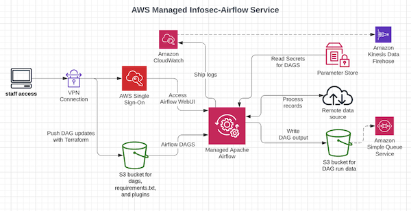

# Airflow for Infosec

Use [Airflow](https://airflow.apache.org/) to pull in remote data via API, pub/sub, kinesis, s3, and more.
Data can be stored using one of multiple outputs such as s3, aurora, postgres etc.

Apache Airflow is typically known for its use within data engineering teams as an ETL tool but there are benefits for 
other teams as well. Using Airflow to help security teams ingest data from remote sources, is an excellent use as well.
Airflow enables security teams to deploy jobs known as DAGs, which help with automation and self-service initiatives
that many organizations are striving for.

<!-- TOC -->
- [Environment](#Environment)
- [Getting Started](#Getting-Started)
- [Access Airflow WebUI](#Access-Airflow-WebUI)
- [Working with DAGS](#Working-with-DAGS)
  - [Preparatory Steps for DAG creation](#Preparatory-Steps-for-DAG-creation)
  - [Creating and Deploying DAGs](#Creating-and-Deploying-DAGs)
  - [Installing Python dependencies](#Installing-Python-dependencies)
  - [Testing DAGS with the MWAA local environment](#Testing-DAGS-with-the-MWAA-local-environment)
  - [Deleting DAG files from Amazon S3](#Deleting-DAG-files-from-Amazon-S3)
- [Maintaining this repo](#Maintaining-this-repo)
- [Additional Resources](#Additional-Resources)
<!-- /TOC -->

## Environment
Managed Workflows for Apache Airflow(MWAA) requires the following:
- A VPC and two subnets in a private zone (provided as a list)
- An IAM role (airflow_iam_role)
- A versioned S3 bucket (airflow_dags_s3_bucket)
- A security group (airflow_security_groups)

Additional configuration options support data output and automation:
- DAG output buckets for data storage (airflow_s3_bucket)
- Optional SQS queue management for DAG data buckets (airflow_sqs_module)
- Optional Cloudwatch to Kinesis log streams (airflow_logstream_to_kinesis)



Airflow can be deployed in other ways. However, the AWS managed Airflow(MWAA) service allows teams to get up and
running quickly, without the need to manage a lot of ad-hoc infrastructure.

## Getting Started
- Clone this repo to somewhere on your local machine
- Run `terraform init` within the **./terraform/prod** directory to initialize any modules

If this is a first time setup or if deploying a new MWAA environment, change the items located in
the **locals.tf** file. The locals.tf file is located within each project directory and is where
settings that should be unique to each specific deployment are stored.

## Access Airflow WebUI
- Login to the AWS account where Airflow was deployed
- Navigate to the **Managed Apache Airflow** environments page and select **Open Airflow UI**

## Working with DAGS
Secrets that are used in DAGs can be stored using one of several options.
- AWS SSM Parameter Store
- AWS Secret Service
- Hashicorp Vault

The above secret storage options require different configurations. Use them when appropriate.

### Preparatory Steps for DAG creation
- Get prepared by compiling necessary information to create a new DAG.
  - What service will your data come from?
      - Is it a new service and will IAM policies need adjustment?
      - Is it a remote API? Are there API docs available? If so, where are the docs located?
  - What credentials are needed?
      - Are API creds necessary or is it an open data source?
  - Will the DAG require a new s3 bucket or can an existing one be used?
  - Will the DAG require installing Python packages?
  - Will the resulting data need to be ingested into a SIEM?
      - If ingesting DAG results into a SIEM, additional configuration is necessary.

### Creating and Deploying DAGs
The process for creating DAGs can get pretty involved. There are resources available on the internet
that speak directly to DAG creation and best practices. This only covers specific deployment steps for
using this project and not as much on how a DAG is constructed. See the [Additional Resources](#Additional-Resources)
section at the bottom of this README.

With that said, there are some example DAGs in the **examples** folder located in the root of this project.
The main thing to know is how the **../files** directory is laid out. By default, there is a **dags**
directory, a **plugins** directory, and an empty **requirements.txt** file.

    files/
       ├── dags
       ├── plugins
       └── requirements.txt

To get started, create a new file in the **dags** folder and add some code to it. If a new output s3 bucket
is also required, add its name to the **locals.tf** file under the `s3_bucket_names` list as well. When the DAG
is ready for deployment and any other necessary changes have been made. Navigate to the correct
directory, which, as noted above is **../terraform/prod**. Once in the right directory, run `terraform plan`
and then run `terraform apply` to deploy the DAG and any other updates that are needed.

Depending on which files were updated, the resulting apply **may take 30-60 seconds for new DAGs to be picked
up**, or it **may take 20-30 minutes if updating plugins or the requirements.txt file**.

### Installing Python dependencies
Say you want to create a DAG that uses **asyncio** and **aiohttp**? Those modules do not exist
as part of the base Python installation, so they have to be installed. Python modules can be installed
by adding them to the **requirements.txt** file located in the **../files** directory.

Example using package names and versions in the requirements.txt file
```txt
asyncio==3.4.3
aiohttp==3.8.1
```

When adding new modules, the MWAA environment will require an update to the existing containers.
The **update process may take between 20-30 minutes**. When the new Airflow environment is available,
those modules are installed and can be imported like normal in any DAG from this point on.

However, it's important to be careful which package versions are used. There are many cases where
version incompatibilities may break other DAGs that rely on certain deployed versions. In those cases,
Airflow provides an option to use **PythonVirtualenvOperator** and may be something to look into.
Although, be aware, it also has certain limitations of use. The best thing is to do proper testing
using the **aws-mwaa-local-runner** prior to deploying changes or new DAGs.

### Testing DAGS with the MWAA local environment
Test DAGs, custom plugins, and Python dependencies using the aws-mwaa-local-runner
<https://github.com/aws/aws-mwaa-local-runner>

Additional helpful tools for local testing:
- <https://localstack.cloud>
- <https://min.io/>

### Deleting DAG files from Amazon S3
The process for removing DAG files is straight forward with Terraform. To remove a DAG or any other file,
navigate to the **../files** directory and delete the file. Once the file is deleted,
run `terraform plan` to see what changes will be made, then run `terraform apply` to apply those changes.
The Airflow environment will automatically pick up the changes within about **30-60** seconds after apply.

When removing items from the **plugins** directory, the **plugins.zip** will automatically be updated
with the appropriate files removed and will require a refresh of the Airflow environment that may
take **20-30 minutes**. When only removing DAG files, there is no environment refresh required.

## Maintaining this repo
The Terraform ecosystem has lots of tools designed to keep tf code readable, documented, and secure.  
Here is a list of some tools that might be helpful and can be run from time to time as changes are made.
- terraform fmt (built-in)
- terraform-docs (<https://github.com/terraform-docs/terraform-docs>)
- tfsec (<https://github.com/aquasecurity/tfsec>)

Examples:  
Run this from the root of the **terraform** directory to format tf files consistently.
```bash
terraform fmt -recursive
```

Run this from within the **../modules** directory to update the README files, if any changes were made to modules.
```bash
for dir in `ls`; do terraform-docs --hide requirements,modules markdown ${dir} > ${dir}/README.md; done
```

If any updates were done to the project dir ex. **../terraform/prod**, run this from inside that directory.
```bash
terraform-docs --hide providers markdown . > README.md
```

## Additional Resources
- <https://docs.aws.amazon.com/mwaa/latest/userguide/amazon-mwaa-user-guide.pdf>
- <https://registry.terraform.io/providers/hashicorp/aws/latest/docs>
- <https://registry.terraform.io/providers/hashicorp/aws/latest/docs/resources/mwaa_environment>
- <https://github.com/apache/airflow/tree/main/airflow/example_dags>
- <https://docs.aws.amazon.com/mwaa/latest/userguide/working-dags.html>
- <https://dnx.solutions/how-to-use-apache-airflow-cli-with-amazon-mwaa>
- <https://eatcodeplay.com/a-simple-dag-to-quickly-purge-old-airflow-logs-274ed5de1567>
